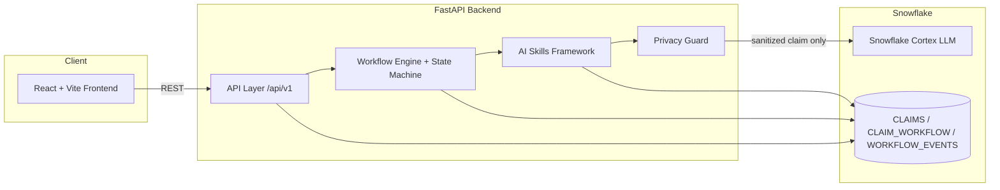
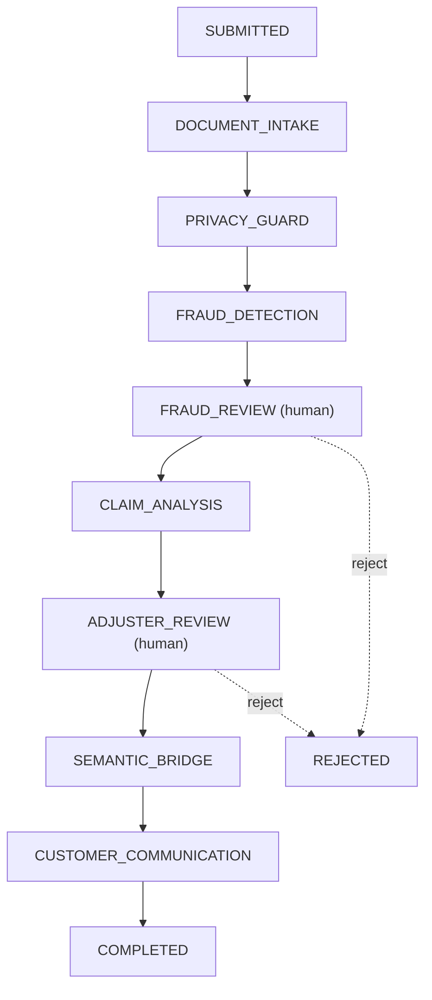
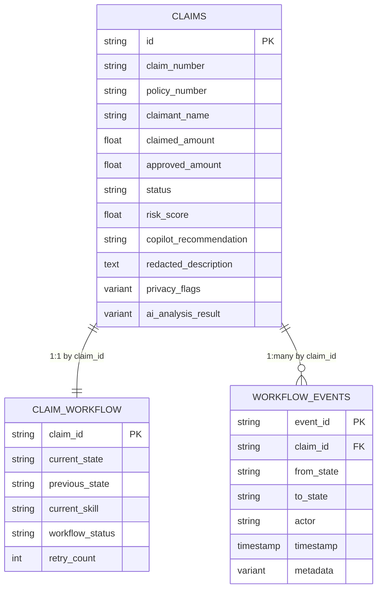

# 🛡️ Insurance Claims AI Copilot

An AI-powered insurance claims copilot built using **Snowflake Cortex** and the **CoCo CLI**.

The copilot assists insurance companies in processing medical claims by combining AI reasoning, domain-specific guardrails, and Human-in-the-Loop decision making.

Built for the **Snowflake CoCo CLI Hackathon**.

---

## Problem Statement

- Manual claim review takes hours or days.
- Claim documents contain unstructured medical information (PDFs, scanned images, free-text narratives).
- Fraud detection requires significant manual effort and domain expertise.
- AI recommendations must remain explainable, not black-box.
- Human adjusters and fraud investigators should remain in control of final decisions.
- Customer communication should use simple, non-technical language, not insurance jargon.

---

## Solution Overview

The Insurance Claims AI Copilot ingests a submitted claim, extracts and structures its data (OCR + LLM parsing), locally masks personally identifiable information before it ever reaches an AI model, runs Snowflake Cortex-powered reasoning for fraud risk and coverage analysis, routes the claim to a human fraud investigator and adjuster at the two decision points that matter, and finally translates the outcome into plain, empathetic language for the customer. Every step is persisted as workflow state and an auditable event, so the system is resumable, explainable, and safe to hand to a human at any point.

---

## Key Features ⭐

- ✅ OCR-based document extraction (EasyOCR)
- ✅ PDF + image support (PyPDF2 / pypdf)
- ✅ Local PII masking before AI inference
- ✅ Human-in-the-loop workflow (fraud review + adjuster review)
- ✅ Fraud confidence scoring with reasoning
- ✅ Explainable reimbursement recommendations
- ✅ Semantic bridging (insurance terminology → customer-friendly language)
- ✅ Workflow orchestration via a resumable state machine
- ✅ Snowflake persistence (Cortex LLMs + VARIANT storage)
- ✅ State-based workflow engine
- ✅ Event sourcing for a full audit trail

---

## High-Level Architecture



---

## Workflow Diagram



`FRAUD_REVIEW` and `ADJUSTER_REVIEW` are pause states — the automatic workflow engine stops and waits for a human decision before continuing.

---

## Data Model

Three tables separate business data, workflow state, and audit history:

```
CLAIMS
│
├── Extracted Text (redacted_description)
├── Structured Claim (claim_number, policy_number, claimant, diagnosis, billing items…)
├── Fraud Analysis (risk_score)
├── Claim Analysis (ai_analysis_result)
├── Final Decision (copilot_recommendation, status)
└── Final Amount (approved_amount)

CLAIM_WORKFLOW
│
├── Current State (current_state / previous_state)
├── Current Skill (current_skill)
├── Workflow Status (workflow_status: ACTIVE / PAUSED / …)
└── Retry Information (retry_count, error_message)

WORKFLOW_EVENTS
│
├── Previous State (from_state)
├── Current State (to_state)
├── Actor (actor: SYSTEM / human reviewer)
├── Timestamp (timestamp)
└── Metadata (metadata VARIANT)
```

### ER Diagram



---

## AI Skills

| Skill | Responsibility |
|---|---|
| Document & Narrative Intake | Extracts raw text from incident narratives, PDFs, and images |
| Privacy Guard | Detects and redacts PII (SSNs, phone numbers, credit cards) before any AI call |
| Claim Parser | Extracts a structured Claim JSON via Snowflake Cortex |
| Fraud Detection | Detects suspicious claims with a risk score and reasoning |
| Coverage Checker | Verifies policy status, coverage window, limits, deductibles, exclusions |
| Claim Analysis | Estimates reimbursement with justification against policy terms |
| Decision Synthesis | Synthesizes extraction, coverage, and fraud outputs into one recommendation |
| Semantic Bridge | Converts insurance terminology into customer-friendly language |
| Customer Communication | Generates and dispatches the final customer response |

---

## Domain Guardrails ⭐

**Privacy**
- PII never reaches the LLM.
- The original claim narrative is stored securely.
- A sanitized, redacted copy is sent for AI reasoning.

**Human Oversight**
- Fraud reviewers approve fraud decisions.
- Adjusters approve reimbursement amounts.
- AI never makes the final decision — it only recommends.

**Structured Outputs**
- Every Skill returns structured JSON (`SkillExecutionResult`).
- The workflow is deterministic and state-driven.
- No free-form AI output is executed directly inside the workflow.

---

## Human-in-the-Loop

```
AI Fraud Analysis
       │
       ▼
Human Fraud Reviewer
       │
       ▼
AI Claim Analysis
       │
       ▼
Human Adjuster
       │
       ▼
Customer
```

AI augments the fraud investigator and the adjuster — it never replaces them. Every recommendation carries reasoning so a human can accept, override, or reject it.

---

## Technology Stack

| Layer | Technology |
|---|---|
| Backend | FastAPI, uv |
| Frontend | React 18, Vite, TypeScript |
| AI | Snowflake Cortex, CoCo CLI |
| OCR / Documents | EasyOCR, PyPDF2, pypdf |
| Database | Snowflake (VARIANT + SQL) |
| Deployment | Docker, docker-compose |

---

## Why Snowflake?

Snowflake Cortex provides managed LLM inference directly next to the data, so claim reasoning never has to leave a secure, governed environment. Its `VARIANT` type lets us store semi-structured AI outputs (extracted claims, fraud analysis, audit metadata) alongside relational fields in the same table, while standard SQL still gives us analytics over claims history. Combined with durable table storage for workflow state and events, Snowflake acts as both the AI engine and the system of record for the entire copilot.

---

## Design Decisions

**Why Human-in-the-Loop?**
High-value insurance claims require human approval — AI recommendations alone aren't sufficient for a fraud or payout decision.

**Why a State Machine?**
It allows resumable, asynchronous processing — a claim can pause for days awaiting human review and pick up exactly where it left off.

**Why Three Tables?**
A simple architecture separating business data (`CLAIMS`), workflow state (`CLAIM_WORKFLOW`), and audit history (`WORKFLOW_EVENTS`).

**Why Local PII Masking?**
No personally identifiable information is shared with AI models — redaction happens before any Cortex call.

**Why Semantic Bridging?**
Insurance terminology (policy clauses, risk codes, payout math) is difficult for customers to understand, so it's translated into plain language before it reaches them.

---

## Future Improvements

- Historical claims retrieval (RAG)
- Policy knowledge base
- Multi-modal fraud detection
- Continuous model evaluation
- Email/SMS notifications

---

## How AI Makes Decisions

- AI does not make final approval decisions.
- AI provides recommendations with explanations (risk scores, coverage reasoning, payout justification).
- Human reviewers (fraud investigator, adjuster) remain in control at every gate.
- Every recommendation is traceable to a workflow step via `WORKFLOW_EVENTS`.

This system is built for **decision support**, not autonomous decision-making.

## How Privacy Is Preserved

- Documents are processed locally (PyPDF2 / EasyOCR) — no third-party OCR service.
- Original claims are stored securely in Snowflake.
- The Privacy Guard skill creates a sanitized, redacted copy of the narrative.
- Only sanitized claim data is sent to downstream AI Skills (fraud detection, claim analysis, semantic bridge).
- Human reviewers and the LLM operate on the minimum necessary information.

---

## Project Structure

```
.
├── backend/                  # FastAPI Application (Python >= 3.11 with uv)
│   ├── app/
│   │   ├── api/             # API Router & Versioned Endpoints (v1)
│   │   │   └── v1/endpoints/ # health, claims, skills endpoints
│   │   ├── config/          # Environment Settings & Structured JSON Logging
│   │   ├── database/        # Async SQLAlchemy engine & session factory
│   │   ├── models/          # SQLAlchemy ORM Models (Claim, AuditLog)
│   │   ├── schemas/         # Pydantic Input/Output Schemas
│   │   ├── services/        # Business Logic & Orchestration
│   │   ├── skills/          # Extensible AI Skills Framework
│   │   ├── utils/           # Structured Logger & Utilities
│   │   ├── workflow/        # Multi-stage Claims Decision Engine Pipeline
│   │   └── main.py          # FastAPI Server Entrypoint & Middleware
│   ├── database/             # Snowflake schema.sql, seed.sql, init_db.py
│   ├── .env.example          # Backend environment variables reference
│   ├── Dockerfile            # Multi-stage Python uv Docker image
│   └── pyproject.toml        # Dependencies & uv environment settings
├── frontend/                  # React 18 + Vite + TypeScript Frontend
│   ├── src/
│   │   ├── components/       # UI components (Navbar, Metrics, ClaimCard, SkillExecutor, etc.)
│   │   ├── services/         # Typed API client for FastAPI backend
│   │   ├── types/            # TypeScript interfaces matching backend models
│   │   ├── index.css         # Dark Mode Glassmorphism Design System
│   │   ├── App.tsx           # Main Dashboard Application
│   │   └── main.tsx          # React Mount Entrypoint
│   ├── Dockerfile             # Multi-stage Nginx Docker image
│   └── package.json           # Node dependencies & Vite scripts
├── docker-compose.yml          # Orchestration for Backend + Frontend containers
├── .env.example                 # Global environment reference
└── README.md
```

---

## Setup

### Prerequisites
- [Python 3.11+](https://www.python.org/)
- [`uv`](https://github.com/astral-sh/uv) (Fast Python Package Installer)
- [Node.js 18+](https://nodejs.org/) & `npm`
- [Docker & Docker Compose](https://www.docker.com/) (optional)
- A Snowflake account with Cortex enabled

### 1. Backend (FastAPI + `uv`)

```bash
cd backend

# Install dependencies and create virtualenv via uv
uv venv
uv pip install -e .

# Initialize the Snowflake schema
uv run python database/init_db.py

# Start development server with reload
uv run uvicorn app.main:app --reload --port 8000
```

- **Swagger Documentation**: [http://localhost:8000/docs](http://localhost:8000/docs)
- **Health Check**: [http://localhost:8000/api/v1/health](http://localhost:8000/api/v1/health)

### 2. Frontend (React + Vite + TypeScript)

```bash
cd frontend
npm install
npm run dev
```

- **Application Dashboard**: [http://localhost:5173](http://localhost:5173)

### 3. Docker (full stack)

```bash
docker-compose up --build
```

- Frontend UI: `http://localhost:5173`
- Backend API: `http://localhost:8000`

---

## Extending AI Skills

All AI Copilot skills inherit from `BaseSkill` in `backend/app/skills/base.py`:

```python
from app.skills.base import BaseSkill
from app.schemas.skill import SkillMeta, SkillExecutionResult

class CustomSkill(BaseSkill):
    @property
    def meta(self) -> SkillMeta:
        return SkillMeta(
            id="skill_custom",
            name="Custom AI Analysis Skill",
            description="Performs custom domain analysis.",
            version="1.0.0",
            category="Domain Rules"
        )

    async def _execute(self, input_data: dict) -> SkillExecutionResult:
        # Implementation logic here
        return SkillExecutionResult(...)
```

Register new skills in `backend/app/skills/__init__.py` to expose them across the decision engine workflow and the **AI Skills Lab** tab.
